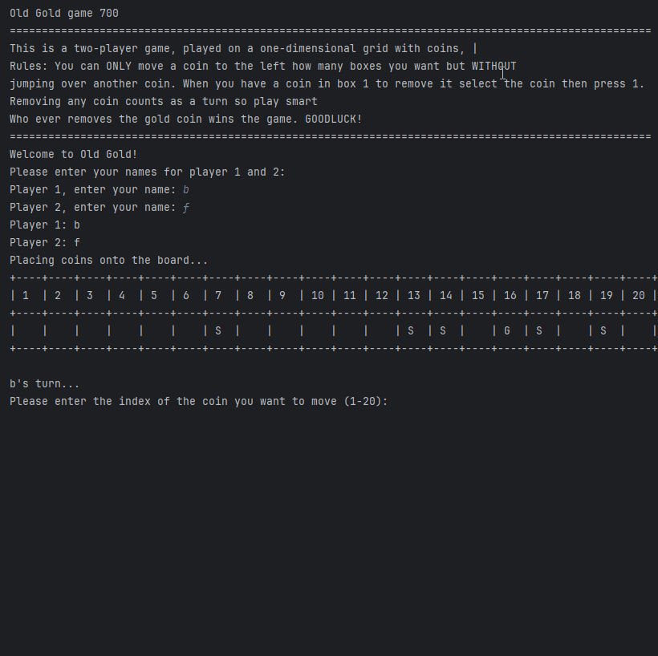

# Development Log

The development log captures key moments in your application development:

- **Design ideas / notes** for features, UI, etc.
- **Key features** completed and working
- **Interesting bugs** and how you overcame them
- **Significant changes** to your design
- Etc.

---

## Date: 29/04/2025

The game wont move any coin the player selects

---

## Date: 29/04/2025

I have fixed the problem with the coin moving I added some old code from my previous attempt and it worked

---

## Date: 28/04/2025

the game isn't removing the silver coins

---

## Date: 28/04/2025

I fixed the problem with the silver coins by adding some code that allows the silver coins to be removed. And it fixed the bug

---

